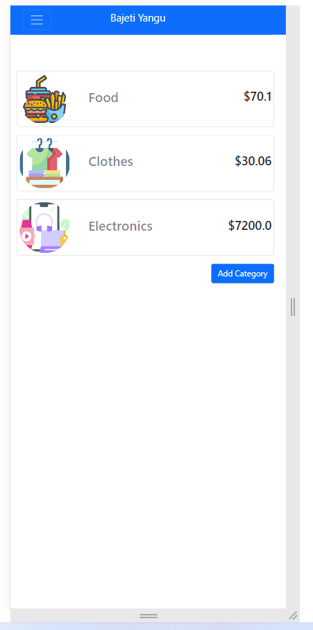

# Budget App

Budget app is about building a mobile web application where you can manage your budget: you have a list of transactions associated with a category, so that you can see how much money you spent and on what.
The application allow users to:

- register and log in, so that the data is private to them.
- introduce new transactions associated with a category.
- see the money spent on each category.

[Live Link](https://evening-lowlands-65023.herokuapp.com/)

[Video Link](https://www.loom.com/share/cd7aeea0db60429283e5feecfb4e1069)

This README documents steps necessary to get the application up and running.

- Ruby version
  - 3.1.2
- PSQL version

  - PostgreSQL 14.0

- System dependencies

  - See [Dependencies](./Gemfile) gem file

- Configuration

  - Install ruby - [Installation guides](https://www.ruby-lang.org/en/documentation/installation/)
  - install PostgreSQL - [Installation guides](https://www.postgresql.org/download/linux/)
  - install libpqdev `sudo apt install libpq-dev ` for linux debian users
  - Make sure your Postgresql is running. If not, start the service by typing `sudo service postgresql start` in your terminal (for linux debian users)

- Installation
  - `git clone` this [repo](https://github.com/mandelatuks/Recipe-app)
  - Run:
    - `cd Recipe-app`
    - `bundle install`
- Database creation

  - Run
    - `rake db:create`

- Tests

  - Run (_ensure your postgreSQL is running as well_)
    - Integrations
      - **Method 1:** `bundle exec rspec test/integration/ `
        > if fails, try
      - **Method 2:** `rspec test/integration/`

- Run project
  - `rails db:migrate:reset db:seed` then
  - Run `rails s` and visit [http://localhost:3000/](http://localhost:3000/) in your browser!

## Author

👤 **Haji Bamsi**

- GitHub: [@Bamsi](https://github.com/bamsi)
- Twitter: [@Bamsi](https://twitter.com/bamsi)
- LinkedIn: [@bamsi](https://linkedin.com/in/bamsi)

## Credit to

Original design idea by [Gregoire Vella on Behance](https://www.behance.net/gregoirevella).

## 🤝 Contributing

Contributions, issues, and feature requests are welcome!

Feel free to check the [issues page](https://github.com/SiansandaTamara/rails-blog-app/issues).

## Show your support

Give a ⭐️ if you like this project!

## 📝 License

This project is [MIT](./MIT.md) licensed.
